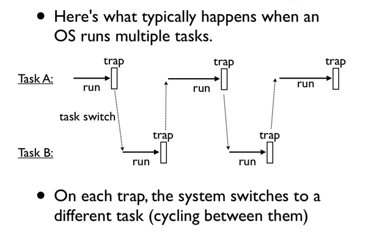
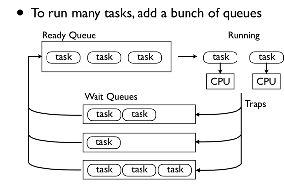

## PyOS

一个由`Python coroutine`实现的简化版操作系统

## Under the hood

现在操作系统中，一般用`进程`来抽象正在运行的任务。进程有以下几个核心特征：

1. 独立的控制流
2. 独立的内部状态
3. 可以被调度（挂起/恢复/关闭）
4. 可以与其他进程通信

`coroutine` 具有上述特征：

1. 一个`coroutine`本身也是一个`subroutine`（子过程），所以拥有独立的控制流
2. 子过程拥有内部变量，可以用来保存内部状态
3. 在一个`coroutine`中，`yield`可以将其挂起，`send`可以将其恢复，`close`可以将其关闭

至于进程的第四个特征（与其他进程通信），是由操作系统协助完成的。那么操作系统是如何在多个进程间进行调度的呢？

### Interrupts and Traps

操作系统是通过中断（interrupts）与陷阱（traps）从正在运行的进程中获取控制权的。

- 中断，一些硬件相关的信号，像I/O中断，时钟（timer）中断，键盘中断等
- 陷阱，由软件产生的信号

当系统发生上面两种情况，CPU 把正在运行的进程挂起，把控制权转交给操作系统，这时操作系统就可以在多个任务间进行切换了。

`yield`语句可以看作是一种`traps`，利用这一点，我们就可以使用 Python 的 `coroutine` 来实现一个操作系统了。

### Task Scheduler

这里实现的操作系统，核心是一个调度器，它里面主要包括两个队列：

- `Ready Queue`，该队列中保存的是可以运行的任务
- `Wait Queue`，该队列中保存的是可以需要等待的任务

## Reference

- http://www.dabeaz.com/coroutines/Coroutines.pdf
- https://www.python.org/dev/peps/pep-0342/
- http://book.pythontips.com/en/latest/coroutines.html
